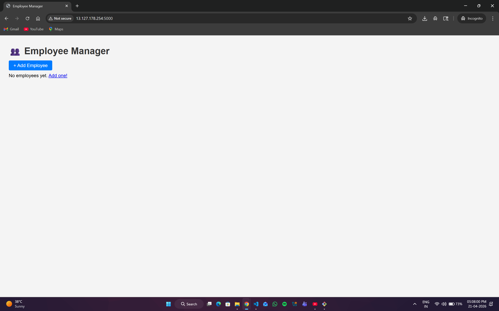
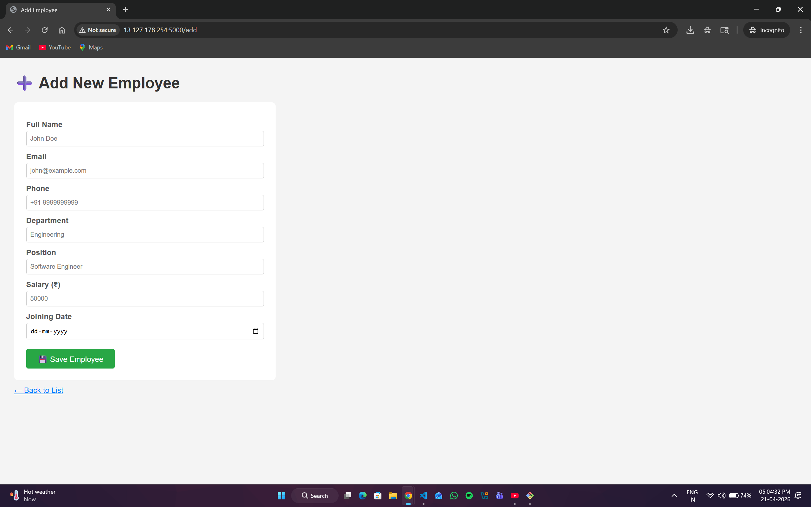
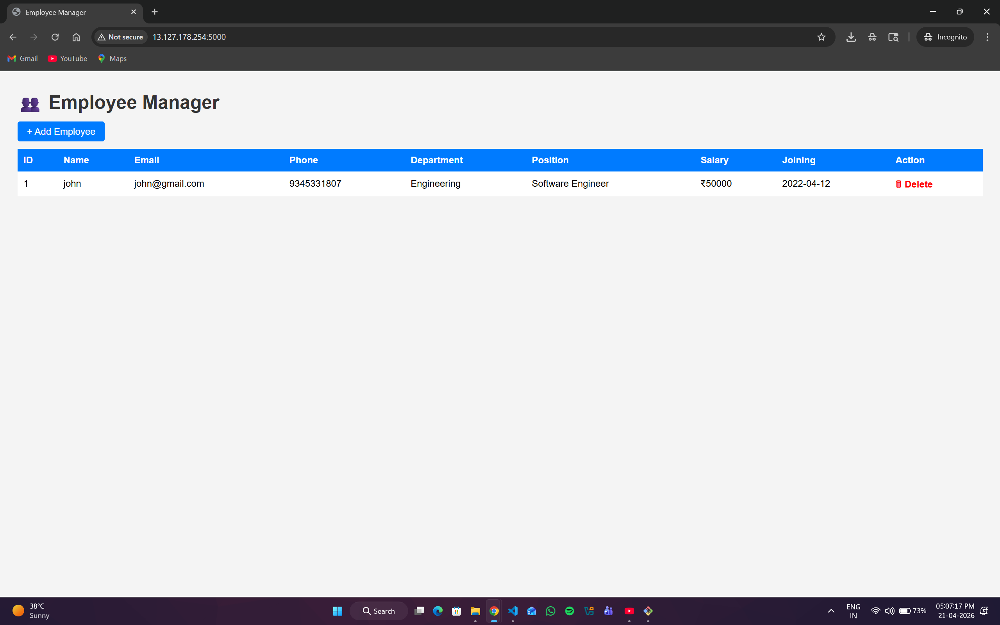

# 👥 Employee Manager

> A lightweight Flask web application to manage employee records — containerized with Docker.

  

---

## 📋 Table of Contents

- [Overview](#-overview)
- [Screenshots](#-screenshots)
- [Features](#-features)
- [Project Structure](#-project-structure)
- [Prerequisites](#-prerequisites)
- [Getting Started](#-getting-started)
- [Usage](#-usage)
- [API Routes](#-api-routes)
- [Data Storage](#-data-storage)
- [Common Errors](#-common-errors)
- [Author](#-author)

---

## 🔍 Overview

Employee Manager is a simple CRUD web application built with **Python + Flask**, served via **Docker**. It allows teams to add, view, and delete employee records through a clean browser interface. Data is persisted locally in a JSON file.

---

## 📸 Screenshots

### 🏠 Home Page — Employee List



> Shows all employees in a table with delete option.

---

### ➕ Add Employee Page



> Form to enter employee details — name, email, phone, department, position, salary, joining date.

---

### ✅ After Adding Employee



> Employee appears in the list after saving.

---

## ✨ Features

| Feature | Description |
|---------|-------------|
| ➕ Add Employee | Enter name, email, phone, department, position, salary, joining date |
| 📋 View All | Table view of all employees |
| 🗑 Delete | Remove employee by ID |
| 💾 Persistent Storage | Data saved in `employees.json` |
| 🐳 Dockerized | Runs in any environment with Docker |

---

## 📁 Project Structure

```
employee-manager/
├── app.py                  # Flask application — routes & logic
├── requirements.txt        # Python dependencies
├── Dockerfile              # Docker build instructions
├── employees.json          # Auto-generated data file (gitignore this)
├── screenshots/            # Add your screenshots here
│   ├── home.png
│   ├── add.png
│   └── after_add.png
└── templates/
    ├── index.html          # Employee list page
    └── add.html            # Add employee form
```

---

## ✅ Prerequisites

- [Docker](https://docs.docker.com/get-docker/) installed
- OR Python 3.11+ for local run

---

## 🚀 Getting Started

### Option 1 — Docker (Recommended)

```bash
# 1. Clone the repository
git clone https://github.com/aryakonly/employee-manager.git
cd employee-manager

# 2. Build Docker image
docker build -t emp-app .

# 3. Run the container
docker run -p 5000:5000 emp-app
```

### Option 2 — Local (Without Docker)

```bash
# 1. Install dependencies
pip install -r requirements.txt

# 2. Run the app
python app.py
```

### Open in Browser

```
http://localhost:5000
```

---

## 🖥 Usage

### Add Employee
1. Click **+ Add Employee** button
2. Fill in the form fields
3. Click **💾 Save Employee**

### View Employees
- All employees displayed in a table on the home page

### Delete Employee
- Click **🗑 Delete** next to any employee row

---

## 🔗 API Routes

| Method | Route | Description |
|--------|-------|-------------|
| `GET` | `/` | List all employees |
| `GET` | `/add` | Show add employee form |
| `POST` | `/add` | Submit new employee |
| `GET` | `/delete/<id>` | Delete employee by ID |

---

## 💾 Data Storage

Employee data is stored in `employees.json` in the project root:

```json
[
  {
    "id": 1,
    "name": "John Doe",
    "email": "john@example.com",
    "phone": "+91 9999999999",
    "department": "Engineering",
    "position": "Software Engineer",
    "salary": "50000",
    "joining": "2026-04-21"
  }
]
```

> ⚠️ **Note:** Data inside Docker container is lost on container restart. Mount a volume to persist data:
> ```bash
> docker run -p 5000:5000 -v $(pwd)/employees.json:/app/employees.json emp-app
> ```

---

## 🐛 Common Errors

| Error | Cause | Fix |
|-------|-------|-----|
| `ModuleNotFoundError: flask` | Flask not installed | Run `pip install -r requirements.txt` |
| Port already in use | Port 5000 busy | Use `-p 5001:5000` instead |
| Data lost on restart | No volume mount | Use `-v` flag (see Data Storage above) |
| Template not found | Wrong folder structure | Ensure `templates/` folder exists beside `app.py` |

---

## 👤 Author

**aryakonly** — [GitHub](https://github.com/aryakonly)

---

## 📜 License

This project is open source and available under the [MIT License](LICENSE).
